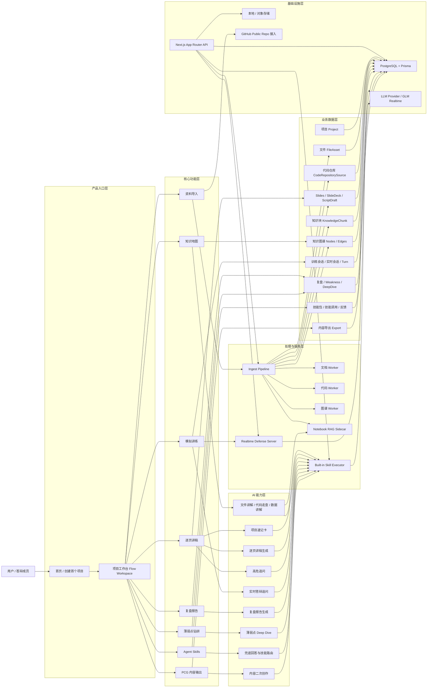
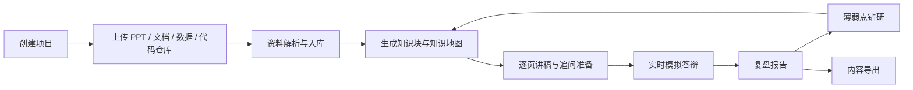

# Presento 产品功能架构图

基于当前代码实现整理，覆盖产品入口、核心业务闭环、AI 能力层、数据与基础设施层。

## 1. 产品全景架构图

## 2. 产品主闭环

## 3. 各模块职责

- 资料导入：支持本地资料上传，也支持接入 GitHub 公开仓库，把代码仓库转成可分析来源。
- 知识地图：把项目资料沉淀成节点、边、风险点、薄弱点和训练入口，是后续讲稿、训练、讲解的中枢。
- 逐页讲稿：围绕 Slide 生成标准讲稿、30 秒版、关键词版、转场句、追问答辩卡，并支持草稿保存。
- 模拟讲练：创建训练会话和实时会话，对当前页进行老师追问、回答、反馈、转场与最终总结。
- 复盘报告：训练结束后自动输出评分、优势、薄弱点、改答建议和下一轮动作。
- 薄弱点钻研：把复盘中的 weakness 转成深挖材料、证据链和补强清单。
- Agent Skills：管理技能包、技能推荐、技能调用记录和用户反馈闭环。
- PCG 内容输出：把训练结果再加工成 QQ 空间摘要、微视口播稿、腾讯视频展示稿。

## 4. 关键实现映射

- 入口与工作台：`src/app/page.tsx`、`src/components/first-project-home.tsx`、`src/components/flow-workspace-view.tsx`
- 产品路由定义：`src/lib/flow-workspace.ts`、`src/lib/project-routes.ts`
- 项目与工作区 API：`src/app/api/projects/route.ts`、`src/app/api/projects/[projectId]/workspace/route.ts`
- 文件 / 仓库导入：`src/app/api/projects/[projectId]/files/route.ts`、`src/app/api/projects/[projectId]/code-repositories/route.ts`
- 资料处理链路：`packages/ingest/src/process-job.ts`、`packages/ingest/src/pipeline.ts`
- 异步 Worker：`workers/document-worker/src/index.ts`、`workers/code-worker/src/index.ts`、`workers/graph-worker/src/index.ts`
- 文件讲解与 RAG：`src/lib/file-explanation-service.ts`、`services/notebook-rag/app/main.py`
- 训练与实时答辩：`src/app/api/projects/[projectId]/training-sessions/route.ts`、`src/app/api/projects/[projectId]/training-sessions/[sessionId]/realtime-sessions/route.ts`、`services/defense-realtime/src/server.ts`
- 复盘与 Deep Dive：`src/app/api/projects/[projectId]/training-sessions/[sessionId]/finish/route.ts`、`src/lib/defense-review.ts`
- 技能体系：`packages/ai/src/skills/registry.ts`、`src/lib/skills-runtime.ts`
- 数据模型：`prisma/schema.prisma`

## 5. 当前产品定位总结

Presento 不是单点的 PPT 答辩辅助工具，而是一个围绕“项目资料理解 -> 表达生成 -> 实时讲练 -> 复盘补强 -> 内容传播”构建的答辩训练操作系统。
