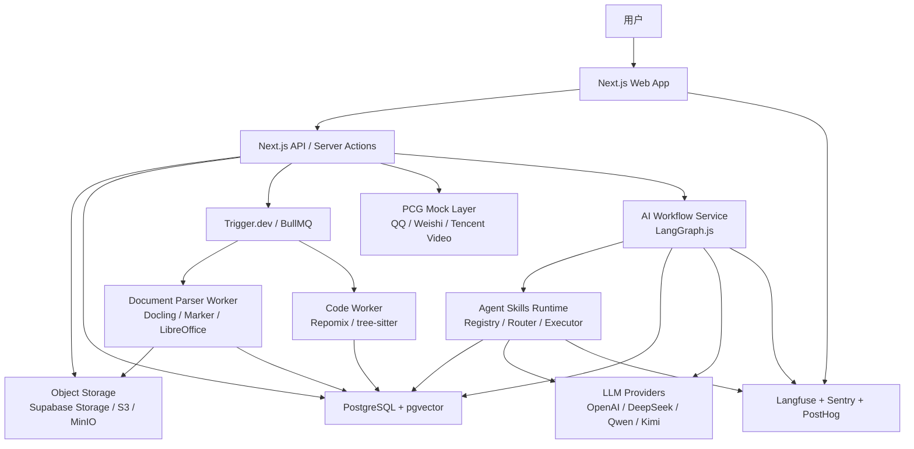

# Presento 技术规划文档

日期：2026-04-26

## 1. 文档目标

本文档面向产品、前端、后端、AI 工程、数据处理和测试工程师，用于统一 Presento MVP 的技术路线。

Presento 的产品目标不是通用 AI 聊天工具，也不是 AI PPT 生成器，而是一个面向校园表达场景的 AI 训练工作台。第一版以“课程项目答辩”为主场景，同时保留向演讲、路演、社团展示、实习汇报和短视频表达扩展的产品结构。

核心业务闭环是：

```text
创建项目
  -> 导入 PPT / 报告 / 代码 / 数据 / 分工说明
  -> 解析为项目知识库
  -> 生成项目知识地图
  -> 生成逐页讲稿和高危追问
  -> 对着当前 PPT 页进行语音模拟答辩
  -> 暴露薄弱点
  -> 进入项目钻研
  -> 生成复盘报告
  -> 转化为 QQ / QQ 空间摘要或微视 / 腾讯视频表达脚本
```

MVP 技术目标：

- 支撑项目创建、资料上传、资料解析和知识库构建。
- 支撑答辩准备台：项目速记卡、逐页讲稿、高危追问、代码 / 数据解释。
- 支撑项目知识地图：Force-Directed Graph、知识节点、文件叶子节点、证据链、风险节点、训练入口。
- 支撑知识地图内的资料讲解：点击 PDF、DOCX、代码、XLSX / CSV 等文件节点后展示文件内容，并提供速通 / 精通两种 AI 讲解和对话。
- 支撑 PPT 同屏语音模拟答辩：当前页上下文、语音状态、AI 老师追问、提示、薄弱点回流、训练复盘。
- 支撑项目钻研：模块深挖、证据链、深度追问链、学习清单。
- 支撑 Agent Skills：系统内置 Skills、用户自定义 Skills、导入 Skills、Skill 调用记录、Skill 输出反馈。
- 支撑 PCG 业务结合的模拟链路：QQ 校园协作入口，微视 / 腾讯视频内容表达出口。
- 保持架构足够轻，避免被 Dify / RAGFlow / Open WebUI 这类通用平台复杂度拖住。

## 2. 技术路线总判断

第一版不建议直接 fork 大型通用 AI 平台作为产品底座。推荐策略是：

> 对通用平台只参考架构边界；对 NotebookLM 类资料讲解、引用回答和 Force-Directed Graph 等明确子能力，优先复用或移植许可证兼容的开源实现，不从零自研。

原因：

- Presento 的差异点在“课程项目答辩 + PPT 同屏语音追问 + 知识地图 + 薄弱点回流 + 表达内容出口”，需要强业务定制。
- Dify、RAGFlow、AnythingLLM、Open WebUI 都偏通用平台，直接 fork 会让产品被通用架构牵着走。
- 比赛 Demo 需要稳定展示完整闭环，但后续仍要按真实前后端产品演进，不能只做静态 mock 页面。
- PCG 结合当前不依赖真实内部接口。MVP 通过 mock 层表达 QQ 和微视 / 腾讯视频业务链路，后续再替换真实接口。

推荐技术主线：

```text
Next.js Web App
  -> Uppy 上传资料
  -> Object Storage 保存原文件和解析产物
  -> Trigger.dev / BullMQ 触发后台任务
  -> Docling / Marker / LibreOffice 解析文档和 PPT
  -> Repomix 处理代码包
  -> 文本切块与元数据抽取
  -> PostgreSQL + pgvector 存储业务数据和向量
  -> LangGraph.js 编排 AI 工作流
  -> Vercel AI SDK 提供实时流式交互
  -> Agent Skills Runtime 管理内置和用户 Skills
  -> Langfuse 记录 Prompt、检索、生成和反馈
```

MVP 的工程定位：

- 前端不是纯静态演示，必须保留真实路由、状态、数据模型和 API 边界。
- 后端可以先用 mock service 返回数据，但接口结构要按真实产品设计。
- 文件解析、RAG、语音识别、外部 PCG 接口可以分阶段替换。
- Agent Skills 不是营销标签，必须有 manifest、schema、触发条件、调用记录和反馈。

## 3. 可参考的开源产品和技术

这些项目分为两类：通用平台只参考结构，不作为产品底座；NotebookLM 类资料讲解和图谱渲染属于明确子能力，可以在许可证允许的范围内直接复用、移植或仿照实现。

| 项目 | 地址 | 参考点 | 本项目用法 |
|---|---|---|---|
| AnythingLLM | https://github.com/Mintplex-Labs/anything-llm | Workspace、文档上传、文档聊天、来源引用、Agent | 参考“一个项目 = 一个 Workspace”的组织方式 |
| Open Notebook | https://github.com/lfnovo/open-notebook | NotebookLM 类资料管理、来源、笔记、引用聊天、内容转换、REST API | 资料讲解能力的优先参考和可移植实现，按 MIT License 保留版权声明 |
| SurfSense | https://github.com/Decentralised-AI/SurfSense-Open-Source-Alternative-to-NotebookLM | NotebookLM / Perplexity 类资料库、 cited answers、混合检索、层级索引、连接器 | 参考或移植文件摄取、引用回答、混合 RAG、资料对话链路，按 Apache-2.0 要求保留 NOTICE / LICENSE |
| Dify | https://github.com/langgenius/dify | Workflow、RAG pipeline、Agent、Prompt 管理、LLMOps | 参考工作流拆分，不直接引入平台 |
| RAGFlow | https://github.com/infiniflow/ragflow | 文档理解、RAG 引擎、复杂文档问答、上下文层 | 参考“文档解析 + 来源溯源”设计 |
| Open WebUI | https://github.com/open-webui/open-webui | 自托管 AI UI、模型接入、RAG、插件机制 | 参考模型配置和聊天 UI，不做通用聊天壳 |
| Slidev | https://github.com/slidevjs/slidev | Presenter Mode、演讲者控制、备注、录制、导出 | 参考同屏答辩的演示控制体验 |
| reveal.js | https://github.com/hakimel/reveal.js | HTML presentation、speaker notes、键盘控制 | 参考 Web 演示和 speaker notes 结构 |
| Repomix | https://github.com/yamadashy/repomix | 将代码仓库打包成 AI 友好文本、过滤和 token 统计 | 可直接作为代码包处理工具 |
| Continue | https://github.com/continuedev/continue | 代码上下文、代码问答、开发者 AI 助手体验 | 参考代码解释体验 |
| Tabby | https://github.com/TabbyML/tabby | 自托管代码助手、代码上下文、团队内部问答 | 参考代码理解和私有化部署思路 |

关键取舍：

- AnythingLLM 的 workspace 思路可借鉴，但不要继承通用文档聊天心智。
- Open Notebook 的 sources / notes / chat / citations / content transformations 是资料讲解的优先参考；可直接移植兼容模块，但必须改造成“答辩速通 / 精通”任务流。
- SurfSense 的多格式文件支持、cited answers、hybrid search 和 hierarchical indices 可作为后端 RAG 的参考或局部移植。
- Dify 的 workflow 思路可借鉴，但 MVP 用 LangGraph.js 自己编排。
- RAGFlow 的复杂文档能力可借鉴，但第一版解析服务用 Docling / Marker / LibreOffice 更轻。
- Slidev / reveal.js 的演讲者视图可借鉴，但 Presento 应围绕用户上传 PPT / PDF 页面自研训练界面。
- Continue / Tabby 的代码上下文可借鉴，但 Presento 的目标不是写代码，而是解释项目代码、准备答辩。

## 4. 推荐开源库与职责边界

### 4.1 Web 与 UI

| 能力 | 推荐库 | 职责 |
|---|---|---|
| 应用框架 | Next.js + TypeScript | Web App、服务端路由、页面渲染、API routes |
| UI 组件 | shadcn/ui + Radix UI | Dialog、Tabs、Sheet、Progress、Popover、Toast、Tooltip |
| 样式 | Tailwind CSS | 工作台、知识地图、训练页、响应式布局 |
| 动效 | Framer Motion | 页面切换、面板展开、节点高亮、语音状态和微交互动效 |
| 图标 | lucide-react | 线性图标，匹配 ima 风格参考 |
| 数据请求 | TanStack Query | 前端缓存、轮询任务状态、乐观更新 |
| 状态管理 | Zustand | 当前项目、当前 PPT 页、训练状态、语音状态 |
| 富文本编辑 | Tiptap | 逐页讲稿编辑、回答框架编辑、复盘改答 |
| 图谱渲染 | sigma.js + graphology + @react-sigma/core | Force-Directed Graph、千级节点渲染、节点邻域高亮、拖拽、缩放、搜索 |
| 图谱布局 | graphology-layout-forceatlas2 / graphology-layout-force | ForceAtlas2 / force layout、节点稳定布局、后端预布局或前端增量布局 |
| 图谱备选 | Cytoscape.js | 复杂交互、compound nodes、图分析和多种 force-directed 扩展布局 |
| 代码阅读 | Monaco Editor / CodeMirror | 代码文件预览、行号、语法高亮、核心片段解释 |
| 表格预览 | SheetJS + TanStack Table | XLSX / CSV 解析预览、工作表切换、字段和指标解释 |

UI 方向：

- 视觉参考 ima：浅灰工作区、大留白、软阴影、轻玻璃、低饱和蓝绿光晕、黑灰文本。
- 不做营销首页，不做典型 SaaS 卡片堆叠，不做通用 AI chat 首页。
- 首页就是核心工作台，第一屏展示项目知识地图、训练状态和 AI 教练建议。
- 动效使用 Framer Motion，重点服务空间层级、状态变化和操作反馈；不做大面积炫技动画。

### 4.2 认证、数据库与存储

| 能力 | 推荐库 / 服务 | 职责 |
|---|---|---|
| 认证 | Better Auth 或 Auth.js | 用户登录、会话管理、OAuth |
| ORM | Prisma | 业务数据建模、迁移、类型安全查询 |
| 主数据库 | PostgreSQL | 用户、项目、文件、PPT 页、生成物、训练记录 |
| 向量检索 | pgvector | 文档块、PPT 页、代码块、数据解释的 embedding 检索 |
| 文件存储 | Supabase Storage / MinIO / S3-compatible Storage | 原文件、解析产物、PPT 页面图片、导出文件 |

MVP 推荐：

- 云端快速验证：Supabase Postgres + Supabase Storage + pgvector。
- 自托管版本：PostgreSQL + pgvector + MinIO。
- 本地开发：Postgres + MinIO，或 Supabase local。

### 4.3 文件上传与预览

| 能力 | 推荐库 | 职责 |
|---|---|---|
| 文件上传 | Uppy | 多文件上传、进度、断点续传扩展、S3 上传 |
| 简单上传备选 | FilePond | 更轻量的拖拽上传 UI |
| PDF 预览 | PDF.js / pdfjs-dist | 渲染 PDF 页面、获取页码、页面缩略图 |
| PPT 预览策略 | LibreOffice headless + PDF.js | `.pptx` 先转 PDF 或图片，再走统一预览链路 |
| DOCX 预览 | Docling / mammoth | 转 Markdown / HTML 后展示章节和段落 |
| 代码预览 | Repomix 输出 + Monaco Editor / CodeMirror | 展示目录树、文件内容、行号和语法高亮 |
| XLSX / CSV 预览 | SheetJS | 展示工作表、表头、单元格范围和字段摘要 |

MVP 原则：

- 推荐用户优先上传 PDF。
- `.pptx` 允许上传，但后台转换为 PDF / 图片后再使用。
- 同屏答辩必须绑定稳定的逐页预览结果，不直接依赖浏览器原生 PPT 渲染。
- 每个 Slide 记录必须保留页码、缩略图、页面图片、OCR / 提取文本和来源文件。

### 4.4 文档解析与代码解析

| 能力 | 推荐工具 | 职责 |
|---|---|---|
| 通用文档解析 | Docling | PDF、DOCX、PPTX、XLSX、HTML、图片等解析为 Markdown / JSON |
| 文档解析备选 | Marker | PDF / 图片 / PPTX / DOCX / XLSX 转 Markdown / JSON |
| 文档解析备选 | Unstructured | 非结构化文档预处理、partition、chunking |
| PPT 转换 | LibreOffice headless | 将 PPTX 转 PDF / 图片 |
| 代码包处理 | Repomix | 代码仓库打包、过滤、token 统计、AI 友好格式 |
| 代码结构深挖 | tree-sitter | 后续做 AST 级模块解析、函数级定位 |

MVP 推荐：

- Docling 作为主解析器。
- Repomix 作为代码 zip / GitHub 仓库处理的主工具。
- tree-sitter 放到第二阶段，在“必须会讲的代码片段”需要函数级定位时引入。

### 4.5 AI 调用、RAG 与编排

| 能力 | 推荐库 | 职责 |
|---|---|---|
| 流式交互 | Vercel AI SDK | 前端实时输出、token streaming、provider 抽象 |
| AI Chat UI | Vercel AI Elements | AI 老师消息流、输入框、响应区、操作按钮等基础组件 |
| 工作流编排 | LangGraph.js | 有状态流程、分支、循环、checkpoint、追问逻辑 |
| 基础组件 | LangChain Core | Document、retriever、text splitter、model wrappers |
| 结构化输出 | Zod | Skill manifest、输入参数、结构化输出、运行时校验 |
| Skill 配置 | YAML / JSON | 描述内置 Skills、Skill Packs、触发条件和 guardrails |
| 模型网关 | LiteLLM | 后续支持多模型、限额、降级、成本控制 |
| 观测 | Langfuse | Prompt、trace、token、检索日志、用户反馈、评估 |
| Prompt 评测 | Promptfoo | Skills 回归评测、红队测试、Prompt 注入测试 |
| 单元测试 | Vitest | Skill router、schema、retriever、graph 分支测试 |

重要判断：

> RAG 编排层使用 LangGraph.js，不用普通 LangChain chain 作为主流程。

原因：

- PPT 同屏语音模拟答辩需要保存当前页、老师角色、难度、用户回答、追问次数、提示次数、薄弱点。
- 训练过程需要判断下一步：继续追问、给关键词、给回答框架、进入钻研、结束复盘。
- 答辩冲刺和项目钻研之间需要状态回流。
- LangGraph.js 适合可控 agent、状态、分支、流式和复杂工作流。

### 4.6 语音能力

MVP 的产品形态必须是“对着 PPT 语音模拟答辩”，但技术实现可以分阶段：

| 阶段 | 能力 | 实现方式 |
|---|---|---|
| MVP 第一版 | AI 老师文字追问 | 由同屏答辩 Graph 基于当前 PPT 页、项目资料、用户回答生成追问 |
| MVP 第一版 | AI 老师 TTS 播报 | 接入 MiniMax TTS，把 AI 老师追问和提示播报出来 |
| MVP 第一版 | 用户点击麦克风后可录音 | 使用浏览器 MediaRecorder 录音，保存音频文件和录音状态 |
| MVP 第一版 | 用户文字输入兜底 | 允许用户直接输入回答；复盘优先基于文字输入或已有转写文本 |
| MVP 第一版 | 复盘基于文字转写 / 输入内容 | 如果有转写文本则使用转写文本；没有转写时使用用户文字回答 |
| 第二阶段 | ASR | 接入可替换 Speech-to-Text Provider，把录音转为文本 |
| 第二阶段 | 语速、停顿、口头禅分析 | 基于 ASR 结果和音频特征做表达分析 |
| 第三阶段 | 实时双向语音对话 | 做低延迟听说闭环、打断和连续对话 |

第一版强制做到：

- AI 老师文字追问。
- AI 老师 TTS 播报。
- 用户点击麦克风后可以录音。
- 用户回答仍允许文字输入兜底。
- 复盘基于文字转写 / 输入内容。

第一版暂不强做：

- 实时 ASR。
- 语速分析。
- 口头禅分析。
- 情绪分析。
- 实时打断式语音对话。

MiniMax 在第一版只作为 TTS Provider 使用。ASR 不与 MiniMax 强绑定，后续通过 `SpeechProvider` 抽象替换。

```ts
type SpeechProvider = {
  synthesize(input: {
    text: string;
    voiceId?: string;
    speed?: number;
  }): Promise<{
    audioUrl?: string;
    audioStream?: ReadableStream;
    traceId?: string;
  }>;

  transcribe?: (input: {
    audioFileId: string;
  }) => Promise<{
    text: string;
    confidence?: number;
    traceId?: string;
  }>;
};
```

### 4.7 PCG Mock Layer

PCG 结合只聚焦：

- QQ / QQ 空间：校园小组协作、训练入口、分工、提醒、成果摘要。
- 微视 / 腾讯视频：项目表达内容出口，生成 30 秒口播、1 分钟项目展示、分镜和观众追问。

当前 Demo 不接真实 PCG API。后端应提供独立 mock layer，避免把 PCG 展示逻辑散落在页面里。

```text
src/server/pcg
  qq-mock.service.ts
  video-export-mock.service.ts
  types.ts
```

MVP 必须明确标注：

- 当前为模拟接入。
- 不依赖真实 QQ 群消息接口。
- 不依赖真实微视 / 腾讯视频发布接口。
- ima、腾讯文档、腾讯会议、CodeBuddy 只能作为视觉或能力参考，不作为 PCG 主业务结合。

### 4.8 后台任务与观测

| 能力 | 推荐工具 | 职责 |
|---|---|---|
| 云端后台任务 | Trigger.dev | 文件解析、embedding、批量生成、长任务、任务状态 |
| 自托管队列 | BullMQ + Redis | 自建任务队列、worker、重试 |
| LLM 观测 | Langfuse | Trace、Prompt、token、用户反馈、失败样本 |
| 应用监控 | Sentry | 前后端异常 |
| 产品分析 | PostHog | 用户路径、转化、功能使用频率 |

MVP 推荐：

- 如果前期部署在 Vercel / Supabase 体系，使用 Trigger.dev。
- 如果明确自托管，使用 BullMQ + Redis。
- Demo 阶段可以用 mock job service，但接口状态必须接近真实任务队列。

## 5. 整体架构



### 5.1 运行组件

1. **Web App**
   - 负责项目创建、上传入口、工作台、知识地图、逐页讲稿、PPT 同屏语音模拟答辩、钻研页、复盘页、Agent Skills 页、PCG 连接页。
   - 技术：Next.js、TypeScript、Tailwind、shadcn/ui、Radix UI。

2. **API 层**
   - 负责项目 CRUD、上传签名、任务触发、训练会话、生成物读取、Skill 调用、PCG mock 数据。
   - 技术：Next.js Route Handlers / Server Actions。

3. **数据库层**
   - 负责业务数据和向量数据。
   - 技术：PostgreSQL、Prisma、pgvector。

4. **文件存储层**
   - 保存原始文件、解析 JSON、Markdown、PPT 页面图片、音频录制文件、导出文件。
   - 技术：Supabase Storage 或 S3-compatible Storage。

5. **解析 Worker**
   - 负责文档解析、PPT 转 PDF / 图片、代码包处理、chunk 和 embedding。
   - 技术：Docling、LibreOffice headless、Repomix。

6. **AI Workflow Service**
   - 负责编排索引、生成、追问、钻研、复盘和内容转化。
   - 技术：LangGraph.js、LangChain Core、Vercel AI SDK。

7. **Agent Skills Runtime**
   - 负责系统 Skills、用户自定义 Skills、导入 Skills 的注册、校验、路由、执行、观测。
   - 技术：Zod、YAML / JSON manifest、Langfuse trace。

8. **PCG Mock Layer**
   - 负责 QQ 和微视 / 腾讯视频业务链路的模拟数据和导出动作。
   - 技术：server service + mock fixtures。

9. **观测与反馈**
   - 记录模型调用、检索结果、生成质量、用户反馈、异常。
   - 技术：Langfuse、Sentry、PostHog。

## 6. 核心 AI 工作流设计

第一版设计 7 个核心 Graph / Workflow。

### 6.1 文件索引 Graph

目标：把用户上传的资料变成可检索、可引用、可生成的项目知识库。

```text
receiveUpload
  -> classifyFile
  -> parseDocument / parseSpreadsheet / parseCodeArchive
  -> extractMetadata
  -> normalizeToProjectSource
  -> chunkBySourceType
  -> embedChunks
  -> writeChunksToPgvector
  -> updateIngestionStatus
```

关键输出：

- `ProjectSource`：原始资料的结构化表示。
- `DocumentChunk`：带来源、页码、文件路径、sheet 名称、代码路径的文本块。
- `SlideDeck`：PPT / PDF 文件。
- `Slide`：PPT / PDF 每一页的页面记录。
- `SourceCitation`：后续回答引用所需的定位信息。

### 6.2 项目知识地图 Graph

目标：把项目资料组织成可展示、可点击、可训练、可学习的知识网络。

```text
loadProjectSources
  -> extractProjectModules
  -> extractSourceNodes
  -> extractFileLeafNodes
  -> extractRiskNodes
  -> extractWeaknessCandidates
  -> buildKnowledgeEdges
  -> scoreNodeRisk
  -> writeKnowledgeGraph
```

关键输出：

- 项目中心节点。
- PPT、代码、数据、AI 模块、用户端、管理端、业务实体等结构节点。
- 文件叶子节点，指向具体 PDF、DOCX、PPT、代码文件、SQL、CSV、XLSX。
- 高危追问节点。
- 薄弱点候选节点。
- 证据链关联边。
- 训练入口关联边。

前端展示：

- 使用 sigma.js + graphology + @react-sigma/core 实现 Force-Directed Graph，不使用 React Flow / xyflow 承载知识图谱。
- 使用 graphology-layout-forceatlas2 或 graphology-layout-force 计算力导向布局；后端可预计算初始布局，前端负责交互、局部展开和稳定动画。
- 图谱支持拖拽画布、缩放、fit view、节点选中、关联边高亮和局部折叠。
- 当用户进入文件阅读态时，图谱收起为左侧窄栏或路径导航，保留当前文件在项目知识网络中的位置。

MVP 可以先用 mock / 规则生成知识地图，但数据结构必须支持后续真实 AI 生成。

### 6.2.1 资料讲解 Graph

目标：用户点击知识地图末端的文件节点后，在当前页面快速理解文件内容，并能围绕文件继续提问。

实现原则：优先复用 Open Notebook、SurfSense 等开源 NotebookLM 类项目中已经验证过的 sources、citations、chat sessions、content transformations、hybrid RAG 和 hierarchical indices 设计。只有 Presento 特有的答辩语境、速通 / 精通输出格式、薄弱点回流和逐页讲稿联动需要自研。

```text
openFileLeafNode
  -> loadProjectSource
  -> loadFilePreview
  -> retrieveFileChunks
  -> chooseExplanationMode
  -> generateFileExplanation
  -> answerFollowUpQuestion
  -> writeFileExplanationSession
  -> optionallyCreateWeaknessOrArtifact
```

文件类型策略：

- `ppt | slide-deck | presentation-pdf`：跳转逐页讲稿页，由 SlideDeck / Slide 体系承接讲稿、页码、证据链和当前页讲练。
- `pdf`：普通报告 PDF 使用 PDF.js 展示页面，讲解引用页码和文本块。
- `docx`：展示解析后的 Markdown / HTML 章节，讲解引用章节标题和段落位置。
- `code`：使用 IDE 风格预览，展示目录树、文件内容、行号和语法高亮，讲解引用 `codePath`、`startLine`、`endLine`。
- `xlsx | csv`：展示工作表、表头、样例行和单元格范围，讲解引用 `sheetName`、`cellRange` 和字段名。

讲解模式：

- `quick` 速通模式：输出一句话总结、核心 3-5 点、最可能被问的问题、30 秒回答框架和下一步训练入口。
- `mastery` 精通模式：输出分段讲解、概念拆解、证据引用、代码 / 表格 / 数据解释、深度追问链、自测题和薄弱点候选。

AI 回答约束：

- 回答必须优先引用当前文件 chunk；必要时再引用同项目相关资料。
- 引用必须带 `sourceId`、文件名和页码 / 行号 / sheet / cell range。
- 如果当前文件缺少依据，必须说明缺少信息，不补编项目细节。
- 用户可以把讲解中的问题加入薄弱点，或把解释片段加入逐页讲稿 / 讲练上下文。

### 6.3 答辩准备 Graph

目标：生成准备台中的核心产物。

```text
loadProjectContext
  -> summarizeProject
  -> generateSlideScripts
  -> generateRiskQuestions
  -> generateCodeOrDataExplanation
  -> scorePreparationReadiness
  -> writeArtifacts
```

关键输出：

- 项目速记卡。
- 逐页讲稿：正常版、30 秒版、关键词版。
- 高危追问库。
- 代码 / 数据解释。
- 准备度分数。
- 今日训练任务。

### 6.4 PPT 同屏语音模拟答辩 Graph

目标：围绕当前 PPT 页面进行语音模拟答辩，而不是普通聊天。

```text
startTrainingSession
  -> loadCurrentSlide
  -> retrieveSlideContext
  -> listenOrReceiveUserAnswer
  -> transcribeIfNeeded
  -> analyzeUserAnswer
  -> routeNextStep
      -> continueFollowUp
      -> provideKeywordHint
      -> provideAnswerFramework
      -> provideReferenceAnswer
      -> createWeaknessAndJumpToDeepDive
      -> finishSession
  -> generateReviewReport
```

状态字段：

- `projectId`
- `sessionId`
- `currentSlideId`
- `currentKnowledgeNodeId`
- `teacherRole`
- `difficulty`
- `voiceState`: `idle | listening | transcribing | thinking | speaking`
- `turns`
- `hintCount`
- `followUpCount`
- `detectedWeaknesses`
- `lastRetrievedSources`
- `shouldFinish`

MVP 规则：

- UI 必须以语音答辩为主，保留文本输入兜底。
- 第一版必须支持 AI 老师文字追问。
- 第一版必须接入 MiniMax TTS，用于 AI 老师追问和提示播报。
- 第一版必须支持用户点击麦克风录音，并保存录音状态和音频文件引用。
- 第一版允许用户使用文字输入兜底。
- 第一版复盘基于文字转写 / 输入内容；如果没有 ASR 转写，则使用用户输入文本。
- 第一版暂不强做实时 ASR、语速分析、口头禅分析、情绪分析和实时打断式语音对话。
- 实时阶段给轻反馈，不每轮完整打分。
- 训练结束后统一生成复盘报告。
- 每个追问必须尽量绑定当前 PPT 页、项目资料、知识节点和用户负责范围。

### 6.5 项目钻研 Graph

目标：把训练中暴露的薄弱点转成可学习、可表达、可回流答辩的内容。

```text
selectWeaknessOrModule
  -> retrieveModuleContext
  -> explainModule
  -> buildEvidenceChain
  -> generateDeepQuestions
  -> generateLearningChecklist
  -> optionallyAddToDefenseAnswer
```

关键输出：

- 模块解释。
- 证据链。
- 深度追问链。
- 学习清单。
- 可加入讲稿或推荐回答的内容片段。

### 6.6 复盘报告 Graph

目标：一次训练结束后，给用户明确下一步怎么补。

```text
loadTrainingTurns
  -> scoreAnswerQuality
  -> identifyWeaknesses
  -> generateBetterAnswers
  -> recommendNextSkills
  -> recommendDeepDiveTasks
  -> writeReviewReport
```

关键输出：

- 总分。
- 表达清晰度。
- 证据支撑度。
- 追问抗压度。
- 当前页掌握情况。
- 高危问题表现。
- 推荐改答版本。
- 下一轮训练任务。
- 可跳转的薄弱点。

### 6.7 内容二次创作 Graph

目标：把答辩内容转化为适合 QQ / QQ 空间、微视和腾讯视频的表达内容。

```text
loadBestAnswersAndProjectSummary
  -> chooseTargetChannel
  -> transformToneAndLength
  -> generateScript
  -> generateStoryboard
  -> generateAudienceQuestions
  -> writeContentExport
```

输出类型：

- QQ / QQ 空间项目摘要。
- 微视 30 秒口播稿。
- 微视分镜。
- 腾讯视频 1 分钟项目展示脚本。
- 标题、简介和标签。
- 观众可能追问。

### 6.8 Agent Skills Runtime

Agent Skills Runtime 是 LangGraph 之上的业务能力层，用来把“生成讲稿、解释代码、当前页追问、兜底回答、复盘报告、内容转化”等能力标准化。

它包含 5 个部分：

1. **Skill Registry**
   - 注册平台内置 Skills。
   - 保存用户自定义 Skills。
   - 保存导入 Skills。
   - 记录 Skill id、名称、来源、适用项目类型、触发场景、输入 schema、输出 schema、需要的工具和 guardrails。

2. **Skill Router**
   - 根据当前页面、用户动作、项目类型、当前 PPT 页、训练状态选择 Skill。
   - 例如用户在同屏答辩页点击“我讲完了”，路由到 `current_slide_followup`。

3. **Skill Executor**
   - 负责执行 Skill。
   - 执行前校验输入，执行中调用 retriever / LLM / 受控工具，执行后校验输出结构。

4. **Tool Layer**
   - 提供受控工具，不让模型自由调用任意能力。
   - MVP 工具包括：`retrieveProjectContext`、`retrieveSlideContext`、`retrieveCodeContext`、`retrieveRiskQuestions`、`writeArtifact`、`createWeakness`、`writeContentExport`。

5. **Skill Trace**
   - 每次 Skill 调用写入 Langfuse。
   - 记录 Skill id、输入摘要、检索来源、模型、输出、用户反馈和失败原因。

#### 6.8.1 系统内置 Skills

MVP 内置 Skill ids：

```text
project_brief
slide_script
risk_questions
current_slide_followup
code_explainer
data_survey_explainer
weakness_deep_dive
fallback_answer
review_report
content_repurpose
```

#### 6.8.2 用户自定义 / 导入 Skills

用户可以创建或导入自己的 Skills，用于适配：

- 某门课老师的追问风格。
- 某个专业的评分标准。
- 某个比赛的评审维度。
- 某类项目的高危问题。
- 自己习惯的回答结构。

自定义 Skill 允许用户配置：

- 名称。
- 描述。
- 触发位置。
- 输入来源。
- 输出类型。
- Prompt 模板。
- 是否要求引用来源。
- fallback 话术。

导入 Skill 使用 JSON / YAML manifest。

推荐 manifest 结构：

```yaml
schemaVersion: presento.skill.v1
id: custom_teacher_followup
name: 王老师追问风格
description: 模拟某门课老师偏爱追问实现细节和个人贡献的风格
origin: imported
pack: sprint
trigger:
  mode: defense
  event: user_finished_slide
projectTypes:
  - software_ai_data
inputSources:
  - current_slide
  - project_summary
  - user_answer
  - member_scope
output:
  type: teacher_followup
guardrails:
  requireCitation: true
  noFabrication: true
  allowExternalTools: false
  maxFollowups: 3
promptTemplate: |
  你是一位课程项目答辩老师。请基于当前 PPT 页、项目资料和学生回答，
  追问一个与实现细节或个人贡献直接相关的问题。
```

边界：

- 自定义 / 导入 Skill 只能调用平台提供的受控工具。
- 不允许执行用户上传代码。
- 不允许访问外部网络。
- 不允许跨项目读取资料。
- 不做公开 Skill 市场。
- 不做跨用户分享、审核和付费分发。

Skill 与 LangGraph 的关系：

```text
LangGraph State
  -> Skill Router
  -> Skill Registry
  -> Skill Executor
  -> Tool Layer / Retriever / LLM
  -> Zod Output Validation
  -> Persist Artifact / Turn / Weakness / Export
  -> Langfuse Trace
```

## 7. 数据模型规划

以下为 MVP 级数据模型，字段名给工程实现提供方向，后续可在 Prisma schema 中细化。

### 7.1 核心实体

| 实体 | 作用 |
|---|---|
| `User` | 用户账号 |
| `Project` | 一个课程项目 / 演讲项目 / 路演项目 |
| `ProjectMember` | 小组成员与分工 |
| `ProjectFile` | 用户上传的原始文件 |
| `ProjectSource` | 解析后的资料来源 |
| `SlideDeck` | PPT / PDF 演示文件 |
| `Slide` | 单页 PPT / PDF |
| `DocumentChunk` | 文档块 / 代码块 / 数据块，带 embedding |
| `KnowledgeNode` | 项目知识地图节点 |
| `KnowledgeEdge` | 项目知识地图关系 |
| `FileExplanationSession` | 知识地图中文件讲解会话 |
| `FileExplanationTurn` | 文件讲解中的用户提问和 AI 回答 |
| `Artifact` | AI 生成物：速记卡、讲稿、解释、复盘 |
| `RiskQuestion` | 高危追问 |
| `TrainingSession` | 一次模拟答辩 |
| `TrainingTurn` | 训练中的一轮问答 |
| `VoiceCapture` | 用户语音录制、转写状态和结果 |
| `Weakness` | 薄弱点 |
| `DeepDive` | 钻研结果 |
| `ReviewReport` | 训练复盘 |
| `ContentExport` | QQ / 微视 / 腾讯视频表达内容 |
| `AgentSkill` | 系统、用户自定义或导入 Skill |
| `SkillPack` | 技能包定义 |
| `SkillInvocation` | 每次 Skill 调用记录 |
| `SkillFeedback` | 用户对 Skill 输出的反馈 |
| `ImportedSkillFile` | 用户导入的 Skill manifest |
| `PcgMockConnection` | PCG 模拟连接记录 |
| `JobRun` | 后台任务状态 |
| `ModelTraceRef` | Langfuse trace id 等观测引用 |

### 7.2 关键关系

```text
User 1 - N Project
Project 1 - N ProjectMember
Project 1 - N ProjectFile
ProjectFile 1 - N ProjectSource
ProjectSource 1 - N DocumentChunk
Project 1 - N SlideDeck
SlideDeck 1 - N Slide
Project 1 - N KnowledgeNode
KnowledgeNode 1 - N KnowledgeEdge
ProjectSource 1 - N FileExplanationSession
FileExplanationSession 1 - N FileExplanationTurn
Project 1 - N Artifact
Project 1 - N RiskQuestion
Project 1 - N TrainingSession
TrainingSession 1 - N TrainingTurn
TrainingTurn 0 - 1 VoiceCapture
TrainingSession 1 - N Weakness
Weakness 1 - N DeepDive
Project 1 - N ReviewReport
Project 1 - N ContentExport
User 1 - N AgentSkill
SkillPack N - N AgentSkill
AgentSkill 1 - N SkillInvocation
Project 1 - N SkillInvocation
SkillInvocation 1 - N SkillFeedback
Project 1 - N PcgMockConnection
```

### 7.3 DocumentChunk 元数据

每个 chunk 必须保留可追溯来源：

- `projectId`
- `sourceId`
- `sourceType`: `slide | report | code | spreadsheet | sql | note`
- `fileName`
- `pageNumber`
- `slideNumber`
- `sheetName`
- `cellRange`
- `codePath`
- `startLine`
- `endLine`
- `text`
- `embedding`

这决定了后续 AI 回答能不能标注“来自 PPT 第 5 页 / README / 某个代码文件 / 某个表格”。

### 7.4 KnowledgeNode 数据结构

```ts
type KnowledgeNode = {
  id: string;
  projectId: string;
  label: string;
  type:
    | "project"
    | "source"
    | "module"
    | "ai"
    | "code"
    | "data"
    | "file"
    | "risk"
    | "weakness"
    | "action";
  fileKind?:
    | "pdf"
    | "docx"
    | "ppt"
    | "presentation-pdf"
    | "code"
    | "sql"
    | "csv"
    | "xlsx";
  sourceId?: string;
  summary?: string;
  riskLevel?: "low" | "medium" | "high";
  position?: { x: number; y: number };
  collapsible?: boolean;
  collapsed?: boolean;
  relatedSlideIds: string[];
  relatedFileIds: string[];
  relatedQuestionIds: string[];
  createdBy: "system" | "skill" | "mock";
};
```

### 7.5 FileExplanationSession 数据结构

```ts
type FileExplanationSession = {
  id: string;
  projectId: string;
  sourceId: string;
  fileId: string;
  knowledgeNodeId: string;
  mode: "quick" | "mastery";
  title: string;
  summary: string;
  keyPoints: Array<{
    title: string;
    detail: string;
    citations: SourceCitationRef[];
  }>;
  riskQuestions: Array<{
    question: string;
    answerFrame?: string;
    riskLevel: "low" | "medium" | "high";
    citations: SourceCitationRef[];
  }>;
  createdWeaknessIds: string[];
  traceId?: string;
};

type FileExplanationTurn = {
  id: string;
  sessionId: string;
  role: "user" | "assistant";
  content: string;
  citations: SourceCitationRef[];
  createdAt: string;
};

type SourceCitationRef = {
  sourceId: string;
  fileName: string;
  pageNumber?: number;
  sheetName?: string;
  cellRange?: string;
  codePath?: string;
  startLine?: number;
  endLine?: number;
};
```

### 7.6 AgentSkill 数据结构

```ts
type AgentSkill = {
  id: string;
  ownerUserId?: string;
  name: string;
  description: string;
  origin: "system" | "custom" | "imported";
  pack: "software" | "ai-data" | "research" | "sprint" | "content";
  trigger:
    | "after-upload"
    | "knowledge-map-node"
    | "file-leaf-node"
    | "slide-script"
    | "practice-answer"
    | "weakness-created"
    | "review-generated"
    | "content-export";
  inputSources: Array<
    | "project-summary"
    | "current-slide"
    | "knowledge-node"
    | "file-context"
    | "user-answer"
    | "code-context"
    | "data-context"
    | "risk-questions"
  >;
  outputType:
    | "brief"
    | "script"
    | "question"
    | "explanation"
    | "file-explanation"
    | "review"
    | "video-script"
    | "checklist";
  promptTemplate?: string;
  outputSchema?: unknown;
  enabled: boolean;
};
```

### 7.7 PCG Mock 数据结构

```ts
type QQGroupMock = {
  id: string;
  projectId: string;
  groupName: string;
  members: Array<{
    name: string;
    role: string;
    responsibility: string;
  }>;
  defenseDate: string;
  reminderEnabled: boolean;
};

type ContentExport = {
  id: string;
  projectId: string;
  channel: "qq-space" | "weishi" | "tencent-video";
  title: string;
  script: string;
  storyboard?: string[];
  audienceQuestions?: string[];
  createdFromArtifactIds: string[];
};
```

## 8. API 与模块边界

### 8.1 前端页面

建议页面结构：

```text
/projects
/projects/new
/projects/[projectId]/setup
/projects/[projectId]/workspace
/projects/[projectId]/files
/projects/[projectId]/knowledge-map
/projects/[projectId]/sprint
/projects/[projectId]/deep-dive
/projects/[projectId]/defense
/projects/[projectId]/review/[sessionId]
/projects/[projectId]/skills
/projects/[projectId]/pcg
```

页面职责：

- `setup`：项目类型、小组分工、我的负责部分、PCG mock 入口选择。
- `workspace`：答辩准备台和项目总览。
- `files`：资料上传、解析状态、文件管理。
- `knowledge-map`：项目知识地图、Force-Directed Graph、文件叶子节点、证据链、风险节点、训练入口、资料讲解。
- `sprint`：速记卡、逐页讲稿、高危追问。
- `deep-dive`：模块钻研、薄弱点修复。
- `defense`：PPT 同屏语音模拟答辩。
- `review`：训练复盘。
- `skills`：系统 Skills、我的 Skills、导入 Skills、调用记录。
- `pcg`：QQ 入口、QQ 空间摘要、微视 / 腾讯视频脚本出口。

### 8.2 后端服务模块

建议模块结构：

```text
src/server/projects
src/server/files
src/server/ingestion
src/server/slides
src/server/knowledge-map
src/server/artifacts
src/server/training
src/server/deep-dive
src/server/reviews
src/server/content-exports
src/server/skills
src/server/pcg
src/server/ai
src/server/observability
```

模块职责：

- `projects`：项目、成员、分工。
- `files`：上传、存储、文件状态。
- `ingestion`：触发解析任务、任务状态。
- `slides`：PPT / PDF 页数据。
- `knowledge-map`：知识节点、关系、图谱布局、文件叶子节点、图谱折叠状态。
- `artifacts`：速记卡、讲稿、问题库、解释、复盘。
- `training`：训练会话、轮次、语音状态。
- `deep-dive`：薄弱点、模块解释、学习清单。
- `reviews`：训练复盘。
- `content-exports`：微视 / 腾讯视频 / QQ 空间表达内容。
- `skills`：Skill registry、Skill packs、Skill invocation、Skill feedback。
- `pcg`：QQ、微视、腾讯视频 mock service。
- `ai`：LangGraph、模型调用、retriever、prompt。
- `observability`：Langfuse、Sentry、业务事件。

### 8.3 API 能力清单

MVP API 按资源拆分，不把所有 AI 能力塞进一个 `/chat` 接口。

```text
POST   /api/projects
GET    /api/projects
GET    /api/projects/:projectId
PATCH  /api/projects/:projectId
DELETE /api/projects/:projectId

POST   /api/projects/:projectId/files/presign
GET    /api/projects/:projectId/files
POST   /api/projects/:projectId/files/:fileId/ingest
GET    /api/projects/:projectId/jobs/:jobId

GET    /api/projects/:projectId/workspace
POST   /api/projects/:projectId/artifacts/generate
GET    /api/projects/:projectId/artifacts
PATCH  /api/projects/:projectId/artifacts/:artifactId

GET    /api/projects/:projectId/slides
GET    /api/projects/:projectId/slides/:slideId

GET    /api/projects/:projectId/knowledge-map
POST   /api/projects/:projectId/knowledge-map/generate
PATCH  /api/projects/:projectId/knowledge-map/nodes/:nodeId
GET    /api/projects/:projectId/knowledge-map/nodes/:nodeId/preview
POST   /api/projects/:projectId/knowledge-map/nodes/:nodeId/explanations
GET    /api/projects/:projectId/file-explanations/:sessionId
POST   /api/projects/:projectId/file-explanations/:sessionId/turns
POST   /api/projects/:projectId/file-explanations/:sessionId/create-weakness

POST   /api/projects/:projectId/training-sessions
GET    /api/projects/:projectId/training-sessions/:sessionId
POST   /api/projects/:projectId/training-sessions/:sessionId/turns
POST   /api/projects/:projectId/training-sessions/:sessionId/voice-captures
POST   /api/projects/:projectId/training-sessions/:sessionId/finish

POST   /api/projects/:projectId/deep-dives
GET    /api/projects/:projectId/deep-dives/:deepDiveId

GET    /api/projects/:projectId/reviews/:sessionId

POST   /api/projects/:projectId/content-exports
GET    /api/projects/:projectId/content-exports

GET    /api/skills
POST   /api/skills
GET    /api/skills/:skillId
PATCH  /api/skills/:skillId
DELETE /api/skills/:skillId
POST   /api/skills/import
GET    /api/skill-packs
GET    /api/projects/:projectId/skill-packs/recommended
POST   /api/projects/:projectId/skills/:skillId/invoke
POST   /api/projects/:projectId/skill-invocations/:invocationId/feedback

GET    /api/projects/:projectId/pcg/qq-group
POST   /api/projects/:projectId/pcg/qq-group/mock-connect
POST   /api/projects/:projectId/pcg/qq-space/export
POST   /api/projects/:projectId/pcg/weishi/export
POST   /api/projects/:projectId/pcg/tencent-video/export
```

实时交互接口可以使用 Vercel AI SDK 的流式响应；后端仍需在每轮结束后持久化 `TrainingTurn`、检索来源和 Langfuse trace id。

### 8.4 推荐仓库结构

如果从零开始，推荐单仓库结构：

```text
apps/web
  app/
  components/
  features/
  server/

packages/db
  prisma/
  src/

packages/ai
  graphs/
  skills/
  prompts/
  retrievers/
  schemas/
  evaluators/

packages/ingest
  parsers/
  chunkers/
  normalizers/

packages/shared
  types/
  constants/
  utils/

workers/document-worker
workers/code-worker
```

边界原则：

- `apps/web` 只放产品界面和轻量 API glue code。
- `packages/db` 只负责数据模型和数据库访问。
- `packages/ai` 只负责 LangGraph、Skill registry、Prompt、检索和结构化输出 schema。
- `packages/ingest` 只负责解析、规范化、切块，不直接调用产品页面逻辑。
- worker 可以调用 `packages/db`、`packages/ai`、`packages/ingest`，但不要反向依赖 Web UI。

## 9. 工程实施分工

### 9.1 前端工程

负责：

- 项目创建向导。
- 上传资料界面。
- 答辩准备台任务卡。
- 项目知识地图 Force-Directed Graph、节点折叠和文件叶子节点。
- 知识地图内的资料阅读器：PDF、DOCX、代码 IDE、XLSX / CSV。
- 资料讲解右侧面板：速通 / 精通模式、AI 对话、引用展示、加入薄弱点。
- PDF / PPT 页面预览。
- PPT 同屏语音模拟答辩布局。
- 讲稿 / 追问 / 钻研结果展示。
- 训练复盘页面。
- Agent Skills 页面。
- PCG 连接页面。

关键难点：

- 同屏答辩页信息密度高，必须稳定展示当前页、聊天、讲稿、语音状态和提示。
- 当前页切换必须同步更新 AI 上下文。
- 知识地图要有创意但不能牺牲可读性，Force-Directed Graph 必须支持稳定聚焦、折叠和文件节点定位。
- 文件阅读态的信息密度高，必须让资料内容、AI 讲解、引用和追问输入同时可读。
- 训练过程需要流式输出和任务状态反馈。

### 9.2 后端工程

负责：

- 项目、文件、成员、训练、生成物、Skills、PCG mock 的数据模型。
- 上传签名、文件状态、任务状态。
- API 权限控制。
- 后台任务触发和结果写入。
- 数据库迁移和索引设计。

关键难点：

- 长任务不能阻塞请求。
- 文件解析失败要可重试。
- 不同文件类型必须有统一状态机。
- Skill 调用必须受权限和工具层约束。

### 9.3 AI / RAG 工程

负责：

- chunk 策略。
- embedding 策略。
- LangGraph 工作流。
- Agent Skills 注册、路由、执行和输出 schema。
- Prompt 模板。
- 引用溯源。
- 知识地图生成。
- 文件叶子节点讲解：速通 / 精通模式、文件内检索、跨资料补充、引用约束。
- 高危追问生成。
- 回答分析和复盘评分。
- 内容二次创作。

关键难点：

- 避免生成泛泛而谈的问题。
- 每个答案尽量绑定来源。
- 实时答辩不能每轮都检索过多上下文，需控制延迟和 token。
- 每个 Skill 必须有明确输入输出、测试样例和失败兜底。

### 9.4 文档解析工程

负责：

- Docling / Marker 集成。
- PPT 转 PDF / 图片。
- 表格、代码、SQL 的解析。
- 解析产物规范化。
- 大文件限制和异常处理。

关键难点：

- `.pptx` 预览稳定性。
- PDF 页码和文本块对齐。
- 表格内容要保留行列语义。
- 代码 zip 要过滤依赖目录、构建产物、敏感文件。

### 9.5 测试与质量工程

负责：

- 文件上传与解析测试。
- RAG 引用准确性测试。
- 生成物结构测试。
- 同屏答辩流程测试。
- Skill 自定义 / 导入测试。
- PCG mock 链路测试。
- 安全和异常路径测试。

关键难点：

- AI 输出不稳定，需要结构化输出和评测 fixture。
- 需要构建小型 fixture 项目：软件类、数据分析类、调研类。

## 10. 安全、隐私与合规

课程项目资料可能包含学生姓名、学号、课程、代码、调查数据，必须按私有资料处理。

MVP 必做：

- 项目文件默认私有。
- 文件访问使用签名 URL。
- 所有 API 校验 `projectId` 所属用户。
- 上传文件限制大小、数量和类型。
- zip 解压必须防 zip slip、zip bomb。
- 代码解析必须过滤 `.env`、密钥、`node_modules`、`.git`、`dist`、`build`。
- Prompt 中明确要求模型基于资料回答，不确定时说明缺少依据。
- Skill 只能读取当前项目资料，不能跨项目读取。
- Skill 只能通过受控工具访问检索、写入和弱点创建能力。
- 自定义 / 导入 Skill 不允许执行任意代码。
- 自定义 / 导入 Skill 不允许调用外部网络工具。
- 用户删除项目时，删除原文件、解析产物、向量和生成物。
- Langfuse / 日志中避免记录完整敏感原文，生产环境做脱敏或采样。

第二阶段考虑：

- 敏感信息扫描。
- 学校 / 课程级数据隔离。
- 本地模型或私有化部署。
- 数据保留周期设置。

## 11. 性能与成本控制

主要成本来自：

- 文档解析。
- embedding。
- 长上下文 LLM 生成。
- 实时答辩多轮聊天。
- 语音转写和语音合成。

控制策略：

- 文件解析异步化。
- 同一文件 hash 命中时复用解析结果。
- chunk embedding 只在内容变化时重算。
- 项目级摘要、文件级摘要、页级摘要分层缓存。
- 实时答辩优先检索当前页相关 chunk，避免全项目检索。
- 高危问题和讲稿批量生成，避免用户每点一次都重新生成。
- 模型分层：普通生成用性价比模型，复盘和复杂钻研用更强模型。
- 自定义 Skill 加 token budget，避免用户 prompt 过长造成成本失控。
- 后续接 LiteLLM 做模型路由、预算、降级和限流。

## 12. MVP 开发阶段

### 阶段 1：产品壳与 Demo 数据

目标：

- 建立 Next.js 路由和基础 layout。
- 完成 ima 风格设计系统。
- 完成工作台、知识地图、资料导入、逐页讲稿、模拟讲练、薄弱点、复盘、Skills、PCG 连接页面。
- 使用 mock 数据跑通完整演示链路。

验收：

- 页面可运行。
- 核心导航完整。
- 知识地图可点击。
- PPT 同屏语音模拟答辩有状态变化。
- Skills 页面能展示内置、创建和导入入口。
- PCG 页面明确展示 QQ 和微视 / 腾讯视频 mock 链路。

### 阶段 2：基础项目与上传闭环

目标：

- 创建课程项目。
- 填写项目类型、小组成员、我的负责部分。
- 上传 PDF / DOCX / Markdown / TXT / CSV / XLSX / SQL / zip。
- 文件进入解析队列。

验收：

- 用户能看到每个文件的上传状态、解析状态、失败原因。
- 项目工作台能读取真实文件列表。

### 阶段 3：资料解析与知识库

目标：

- Docling 解析文档。
- PDF / PPT 生成逐页预览。
- Repomix 处理代码包。
- 文本切块并写入 pgvector。

验收：

- 能按来源检索资料。
- 能定位到 PPT 页码、文档页码、代码路径、表格来源。

### 阶段 4：答辩准备台与知识地图

目标：

- 生成项目速记卡。
- 生成逐页讲稿。
- 生成高危追问。
- 生成代码 / 数据解释。
- 生成项目知识地图。
- 展示准备度。

验收：

- 生成物结构稳定。
- 每个高危问题带来源或“依据不足”说明。
- 知识地图节点能关联 PPT、代码、问题和训练入口。

### 阶段 5：PPT 同屏语音模拟答辩

目标：

- 当前 PPT 页 + AI 老师追问 + 当前页讲稿 / 关键词。
- AI 根据当前页和用户回答追问。
- 用户可请求关键词、回答框架、完整参考答案。
- 训练结束生成复盘。

验收：

- 当前页切换后，AI 追问上下文随之变化。
- 训练记录完整保存。
- 复盘能指出薄弱点并跳转项目钻研。

### 阶段 6：项目钻研

目标：

- 从高危问题或薄弱点进入钻研。
- 生成模块解释、证据链、深度追问链、学习清单。
- 可将钻研结果加入讲稿或推荐回答。

验收：

- 用户能从“答不上来”进入“补理解”。
- 钻研内容可回流到答辩回答。

### 阶段 7：Agent Skills 产品化

目标：

- 注册系统内置 Skills。
- 支持用户创建自定义 Skill。
- 支持导入 Skill manifest。
- 展示推荐 Skill Packs。
- 在准备台、同屏答辩、项目钻研中显示当前调用的 Skill。
- 支持用户对 Skill 输出反馈“有用 / 不准 / 太泛 / 缺少依据”。

验收：

- 每个系统 Skill 都能独立调用并返回结构化结果。
- 自定义 Skill 能通过 schema 校验。
- 导入 Skill 有错误提示和安全检查。
- 每次 Skill 调用都有 Langfuse trace 或本地 trace 记录。
- Skill Pack 能按项目类型自动推荐。

### 阶段 8：PCG Mock 出口

目标：

- 模拟从 QQ 小组群创建训练项目。
- 生成 QQ / QQ 空间项目摘要。
- 生成微视 30 秒口播脚本。
- 生成腾讯视频 1 分钟项目展示脚本。

验收：

- PCG 结合不依赖真实 API。
- 页面明确说明“模拟接入”。
- 内容输出能引用项目速记卡、优秀回答和复盘结果。

## 13. 许可证与依赖治理

工程启动前必须做一次 license scan，避免把不适合商业化或闭源分发的依赖引入核心路径。

原则：

- 优先使用 MIT、Apache-2.0、BSD、ISC 这类宽松许可证。
- 对 AGPL、SSPL、Elastic License、带品牌保留条款或商业限制的项目，只做参考，不进入运行时依赖。
- Open Notebook、SurfSense、sigma.js、graphology、Cytoscape.js 等如需直接复制、移植或二次改造代码，必须保留原项目 LICENSE / NOTICE / copyright，并在依赖登记中记录复制来源、提交版本和改动范围。
- Marker、Open WebUI、Dify、RAGFlow 等项目在引入前必须复核最新 LICENSE 和商业使用限制。
- 所有依赖写入 `docs/technical/dependency-register.md`，记录用途、许可证、替代方案和是否进入生产。
- Docker 镜像也要纳入依赖治理，包括 LibreOffice、Python parser、OCR 模型和系统包。

第一版应把 Dify、RAGFlow、Open WebUI、Continue、Tabby 明确归类为“参考项目”，不要作为生产依赖。Open Notebook、SurfSense、sigma.js、graphology、Cytoscape.js 属于可进入实现评估的子能力来源，但必须先完成 license scan。

## 14. 第一版不做

明确不进入 MVP：

- 多人协作邀请和权限系统。
- 在线 PPT 编辑器。
- 自动生成完整 PPT。
- 真实 QQ / 微视 / 腾讯视频 API。
- 真实视频发布。
- 公开项目广场。
- 完整课程管理系统。
- 移动端 App。
- 自建模型训练。
- 第三方 Skill 市场。
- 跨用户 Skill 分享、审核和付费分发。
- 用户自定义 Skill 脚本执行。
- 任意外部工具调用。
- 多 Agent 自主协作平台。
- 视频表情分析。
- 复杂图数据库。

可后置但预留：

- 真实 ASR。
- 语速分析。
- 口头禅分析。
- 情绪分析。
- 实时打断式语音对话。
- 录音复盘。

## 15. 技术风险与应对

| 风险 | 影响 | 应对 |
|---|---|---|
| PPTX 转换不稳定 | 同屏答辩核心体验受损 | 优先支持 PDF；PPTX 后台转 PDF，失败时提示用户上传 PDF |
| AI 输出泛泛 | 用户感知像普通 ChatGPT | 强制绑定当前页、来源 chunk、项目类型、用户分工 |
| 知识地图过于花哨 | 评委看不清产品价值 | sigma.js + graphology 采用稳定力导向布局，节点详情、证据链和文件入口必须清楚 |
| 复用开源 NotebookLM 类项目带来许可证或架构耦合 | 法务和后续维护风险 | 只复用 MIT / Apache-2.0 等兼容模块；复制代码必须登记来源；不要把完整通用研究平台变成产品底座 |
| 文档解析慢 | 用户等待过久 | 任务异步化、进度状态、先生成可用摘要，深度解析后台完成 |
| 引用不准 | 信任度下降 | chunk 保留来源元数据；回答展示引用；无依据时说明 |
| 代码包太大 | 成本和延迟上升 | Repomix 过滤依赖目录；设置文件大小和 token 限制 |
| Prompt 注入 | 资料中恶意文本影响系统指令 | 系统 prompt 明确资料不可信；工具层隔离；引用资料只作为证据 |
| 语音能力不稳定 | 训练体验受损 | MVP 使用 MiniMax TTS 做 AI 老师播报，用户侧保留文字兜底；ASR 和语音评测后置 |
| 成本失控 | 商业不可持续 | 缓存、模型分层、token budget、后续 LiteLLM 限额 |
| LangGraph 流程过度设计 | MVP 变慢 | 第一版只做核心 Graph，不做多 agent 平台 |
| Skill 变成营销概念 | 工程不可测试，用户感知不到差异 | 每个 Skill 必须有触发入口、schema、测试样例和 trace |
| 自定义 Skill 越权 | 用户隐私和项目隔离风险 | Skill Executor 强制 projectId，工具层做权限校验 |
| PCG 表达被误解为真实接入 | 评审质疑接口真实性 | 页面和文档明确写“模拟接入，用于展示业务链路” |

## 16. 测试策略

### 16.1 Fixture 项目

至少准备 3 套测试资料：

1. 软件项目：PPT + README + 代码 zip + SQL。
2. 数据分析项目：PPT + 报告 + CSV / XLSX + 图表说明。
3. 调研项目：PPT + Word 报告 + 问卷数据 + 访谈记录。

每套 fixture 需要包含：

- 项目介绍。
- 小组分工。
- PPT 页。
- 高危追问预期。
- 薄弱点预期。
- 内容转化预期。

### 16.2 自动化测试

必须覆盖：

- 文件类型识别。
- 解析任务状态机。
- chunk 元数据完整性。
- pgvector 检索返回来源。
- 生成物 JSON schema 校验。
- 知识地图节点和边生成。
- 训练会话状态流转。
- 语音状态机。
- 权限隔离。
- Skill 输入输出 schema 校验。
- Skill router 分支测试。
- 自定义 / 导入 Skill manifest 校验。
- PCG mock service 输出。

### 16.3 AI 质量评估

用固定 fixture 做回归评估：

- 速记卡是否覆盖项目目标、方法、数据、分工。
- 逐页讲稿是否引用当前页内容。
- 高危追问是否与项目资料相关。
- 实时追问是否跟随当前页变化。
- 复盘是否能识别薄弱点。
- 知识地图是否生成合理节点和证据链。
- 内容转化是否适合 QQ / 微视 / 腾讯视频语境。
- 每个 Skill 是否完成它声明的答辩动作。
- Promptfoo 对高危追问、兜底回答、复盘报告、自定义 Skill 做回归评测。

Langfuse 中保存：

- prompt 版本。
- skill id 和 skill 版本。
- 模型。
- 检索 chunk。
- 输出。
- 用户反馈。
- 失败原因。

## 17. 开发环境与发布策略

### 17.1 环境分层

至少提供 3 套环境：

- `local`：开发者本地，使用本地 Postgres / Supabase local、对象存储 mock 或 MinIO。
- `staging`：联调环境，连接真实对象存储、真实 LLM provider、Langfuse staging project。
- `production`：正式环境，开启速率限制、日志脱敏、备份和告警。

### 17.2 CI/CD

MVP CI 必须包含：

- TypeScript typecheck。
- ESLint / Biome。
- 单元测试。
- Prisma schema 校验和迁移检查。
- 构建检查。
- 依赖许可证扫描。

发布前必须人工验证：

- 软件项目 fixture 完整流程。
- 数据分析项目 fixture 完整流程。
- 调研项目 fixture 完整流程。
- PPT 同屏语音模拟答辩至少完成 3 轮问答并生成复盘。
- 自定义 Skill 创建、导入、调用、反馈。
- PCG mock 输出。

### 17.3 配置管理

所有模型、embedding、对象存储、Langfuse、任务队列配置通过环境变量管理。

关键配置：

```text
DATABASE_URL
OBJECT_STORAGE_ENDPOINT
OBJECT_STORAGE_BUCKET
OBJECT_STORAGE_ACCESS_KEY
OBJECT_STORAGE_SECRET_KEY
LLM_PROVIDER
LLM_API_KEY
EMBEDDING_MODEL
CHAT_MODEL_FAST
CHAT_MODEL_STRONG
MINIMAX_API_KEY
MINIMAX_TTS_MODEL
MINIMAX_TTS_VOICE_ID
LANGFUSE_PUBLIC_KEY
LANGFUSE_SECRET_KEY
TRIGGER_SECRET_KEY
PCG_MOCK_MODE
```

## 18. 推荐技术选型结论

MVP 推荐：

| 层 | 选型 |
|---|---|
| Web | Next.js + TypeScript |
| UI | Tailwind + shadcn/ui + Radix UI + lucide-react |
| Motion | Framer Motion |
| Auth | Better Auth 或 Auth.js |
| DB | PostgreSQL + Prisma |
| Vector | pgvector |
| Storage | Supabase Storage，后续可切 MinIO / S3 |
| Upload | Uppy |
| Preview | PDF.js |
| Knowledge Map | sigma.js + graphology + @react-sigma/core + graphology-layout-forceatlas2 |
| Knowledge Map 备选 | Cytoscape.js |
| Document Parser | Docling，Marker 作为备选 |
| PPT 转换 | LibreOffice headless |
| Code Parser | Repomix，后续 tree-sitter |
| AI Streaming | Vercel AI SDK |
| AI Chat UI | Vercel AI Elements |
| NotebookLM-like | 优先复用 Open Notebook / SurfSense 的 sources、citations、chat sessions、content transformations 和 RAG 设计 |
| Workflow | LangGraph.js |
| Agent Skills | LangGraph.js + Zod + YAML / JSON manifest + Langfuse trace |
| RAG Base | LangChain Core / 自写 retriever |
| Jobs | Trigger.dev，或 BullMQ + Redis |
| Observability | Langfuse + Sentry + PostHog |
| AI Eval | Promptfoo + Vitest |
| Voice MVP | MiniMax TTS + 用户录音 + 文字兜底；ASR 和语音评测后置 |
| PCG | QQ / 微视 / 腾讯视频 mock service |
| Model Gateway | 直接接模型 API；后续 LiteLLM |

不推荐第一版使用：

- Dify 作为运行时平台。
- RAGFlow 作为运行时平台。
- Open WebUI 作为基础产品壳。
- React Flow / xyflow 作为知识地图 Force-Directed Graph 主库。
- Qdrant，除非 pgvector 性能已经成为瓶颈。
- 多 Agent 自主协作平台。
- 真实 PCG 产品接口。

## 19. 参考资料

- LangGraph.js: https://github.com/langchain-ai/langgraphjs
- LangGraph JavaScript workflows and agents: https://docs.langchain.com/oss/javascript/langgraph/workflows-agents
- Vercel AI SDK: https://github.com/vercel/ai
- Vercel AI Elements: https://github.com/vercel/ai-elements
- Open Notebook: https://github.com/lfnovo/open-notebook
- SurfSense: https://github.com/Decentralised-AI/SurfSense-Open-Source-Alternative-to-NotebookLM
- sigma.js: https://www.sigmajs.org/
- graphology: https://graphology.github.io/
- @react-sigma/core: https://github.com/sim51/react-sigma
- Cytoscape.js: https://js.cytoscape.org/
- MiniMax API Docs: https://platform.minimax.io/docs/api-reference/api-overview
- MiniMax TTS WebSocket: https://platform.minimax.io/docs/api-reference/speech-t2a-websocket
- Zod: https://github.com/colinhacks/zod
- Model Context Protocol TypeScript SDK: https://github.com/modelcontextprotocol/typescript-sdk
- Mastra: https://github.com/mastra-ai/mastra
- Composio: https://github.com/ComposioHQ/composio
- Promptfoo: https://github.com/promptfoo/promptfoo
- Dify: https://github.com/langgenius/dify
- AnythingLLM: https://github.com/Mintplex-Labs/anything-llm
- RAGFlow: https://github.com/infiniflow/ragflow
- Open WebUI: https://github.com/open-webui/open-webui
- Docling: https://github.com/docling-project/docling
- Marker: https://github.com/datalab-to/marker
- Unstructured: https://github.com/Unstructured-IO/unstructured
- PDF.js: https://github.com/mozilla/pdf.js
- Repomix: https://github.com/yamadashy/repomix
- tree-sitter: https://github.com/tree-sitter/tree-sitter
- Slidev: https://github.com/slidevjs/slidev
- reveal.js: https://github.com/hakimel/reveal.js
- pgvector: https://github.com/pgvector/pgvector
- Trigger.dev: https://github.com/triggerdotdev/trigger.dev
- BullMQ: https://github.com/taskforcesh/bullmq
- Langfuse: https://github.com/langfuse/langfuse
- Supabase: https://github.com/supabase/supabase
